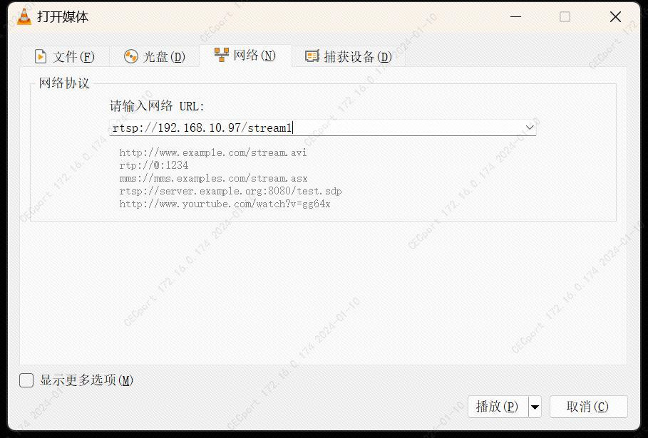
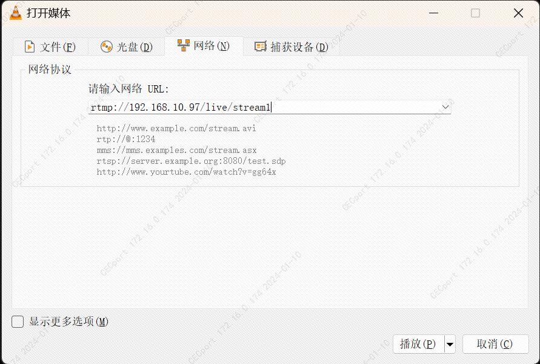

# 3516dv500_app

#### 介绍
基于海思Hi3516DV500 SDK 010 glibc 版本(Hi3519DV500_SDK_V2.0.1.0)的IPC摄像头demo，支持以下功能: 
1. H264/H265 rtsp服务 
2. H264 rtmp服务 
3. OSD(时间)功能 
4. 海思AIISP 
5. 海思图像自适应 
6. 海思编码自适应 
7. Mp4文件保存(当前支持h264)

当前支持的sensor为: 
1. OS04A10 


#### 编译方法
1. 按照Hi3519DV500_SDK_V2.0.1.0/smp/a55_linux/source/bsp/readme_cn.txt文档编译SDK

2. 按照如下命令，编译app
```
cd Hi3519DV500_SDK_V2.0.1.0/smp/a55_linux/source/mpp/sample
git clone https://gitee.com/shumjj/3516dv500_app.git 
cd 3516dv500_app
make
```

#### 目录结构
```
├── aiisp                   //海思AI ISP实现
├── app_std.h               //app头文件
├── device                  //海思设备相关
├── doc                     //doc
├── json                    //json库
├── log                     //log库
├── main.cpp
├── Makefile
├── README.md
├── rootfs                  //SDK rootfs修改部分
├── rtmp                    //rtmp 实现
├── rtsp                    //rtsp 实现
├── thirdlibrary            //第三方库
└── util                    //通用头文件
```

#### 烧录&运行
1. 烧录版本库中rootfs/rootfs_3516dv500_96M_mjj.ext4（该版本为glibc版本，需要烧录对应的uboot,kernel) 
2. 运行 
```
cd /opt/ceanic/ko
./load3519dv500 -i
cd /opt/ceanic/bin
./ceanic_app
```

#### 配置文件说明
##### vi.json
```
{
   "sensor1" : {
      "flip" : 0,
      "fr" : 30,
      "h" : 1520,
      "name" : "OS04A10",
      "w" : 2688
   }
}
```
|  类型            | 说明                                                                                  |
|  ----            | ----                                                                                  |
| flip             | 保留                                                                                  |
| fr               | 帧率                                                                                  |
| h                | sensor视频高                                                                          |
| name             | sensor类型,当前支持"OS04A10","OS04A10_WDR"                                            |
| w                | sensor视频宽                                                                          |

##### venc.json
```
{
   "venc1" : {
      "bitrate" : 4000,
      "fr" : 30,
      "h" : 1520,
      "name" : "H264_CBR",
      "w" : 2688
   }
}
```
|  类型            | 说明                                                                                  |
|  ----            | ----                                                                                  |
| bitrate          | 编码码率(kbps),当前支持CBR(平均码率),AVBR(最大码率)                                   |
| fr               | 编码帧率                                                                              |
| h                | 编码视频高                                                                            |
| name             | 编码类型,当前支持"H264_CBR","H264_AVBR","H265_CBR","H265_AVBR"                        |
| w                | 编码视频宽                                                                            |


##### net_service.json
```
{
   "net_service" : {
      "rtmp" : {
         "enable" : 1,
         "main_url" : "rtmp://192.168.10.97/live/stream1",
         "sub_url" : "rtmp://192.168.10.97/live/stream2"
      },
      "rtsp" : {
         "port" : 554
      }
   }
}
```
|  类型            | 说明                                                                                  |
|  ----            | ----                                                                                  |
| rtsp:port        | RTSP 侦听端口,默认554                                                                 |
| rtmp:enable      | 0:不启用rtmp 1:启用rtmp                                                               |
| rtmp:main_url    | rtmp 主编码数据url                                                                    |
| rtmp:sub_url     | rtmp 子编码数据url                                                                    |

##### aiisp.json
```
{
   "aiisp" : {
      "enable" : 1,
      "mode" : 0,
      "model_file" : "/opt/ceanic/aiisp/aibnr/model/aibnr_model_denoise_priority_lite.bin"
   }
}
```
|  类型            | 说明                                                                                  |
|  ----            | ----                                                                                  |
| enable           | 1:启用 0:启用                                                                         |
| mode             | 0:aibnr 1:aidrc 2:ai3dnr                                                              |
| model_file       | 模型文件绝对路径，需要和mode中的类型匹配                                              |

##### scene.json
```
{
   "scene" : {
      "dir_path" : "/opt/ceanic/scene/param/sensor_os04a10",
      "enable" : 1,
      "mode" : 0
   }
}
```
|  类型            | 说明                                                                                  |
|  ----            | ----                                                                                  |
| enable           | 1:启用 0:启用                                                                         |
| dir_path         | scene使用的配置目录路径                                                               |
| mode             | scene mode序号(见config_scenemode.ini)                                                |

##### rate_auto.json
```
{
   "rate_auto" : {
      "file" : "/opt/ceanic/etc/config_rate_auto_base_param.ini",
      "enable" : 1,
   }
}
```
|  类型            | 说明                                                                                  |
|  ----            | ----                                                                                  |
| enable           | 1:启用 0:启用,只有AVBR编码才有效                                                      |
| file             | 编码自适应使用的文件路径                                                              |

##### mp4_save.json
```
{
   "mp4_save" : {
      "file" : "/mnt/test.mp4",
      "enable" : 0,
   }
}
```
|  类型            | 说明                                                                                  |
|  ----            | ----                                                                                  |
| enable           | 1:启用 0:启用                                                                         |
| file             | mp4保存路径                                                                           |


#### RTSP
##### RTSP URL
url为:   
rtsp://192.168.10.98/stream1   
rtsp://192.168.10.98/stream2  
其中192.168.10.98需要修改为实际的板端地址,stream1为主编码(高清)码流，stream2为子编码(标清)码流  
##### VLC连接RTSP
vlc连接方法:媒体->打开网络串流->输入RTSP URL



#### RTMP
rtmp默认不开启,需要修改/opt/ceanic/etc/net_service.json文件  
##### RTMP测试服务器(nginx)搭建(ubuntu20.04)
1. 按照如下命令编译nginx,需要注意的是运行nginx, -C 后面的参赛需要是全路径
```
wget http://nginx.org/download/nginx-1.21.6.tar.gz

wget https://github.com/arut/nginx-rtmp-module/archive/master.zip

tar -xf nginx-1.21.6.tar.gz

unzip master.zip

cd nginx-1.21.6/

./configure --prefix=`pwd`/mybuild --with-http_ssl_module --add-module=../nginx-rtmp-module-master

make && make install

cd mybuild/sbin

sudo ./nginx -c /home/mjj/work/nginx-1.21.6/mybuild/sbin/nginx_rtmp.conf
```
2. nginx_rtmp.conf见rtmp目录

3. 查看nginx rtmp服务是否开启
```
~/work/nginx-1.21.6/mybuild/sbin$ sudo netstat -na | grep 1935
tcp        0      0 0.0.0.0:1935            0.0.0.0:*               LISTEN
```
4. 查看rtmp 日志
错误日志如下 
```
mjj@mjj-VirtualBox:~/work/nginx-1.21.6/mybuild/sbin$ tail ../logs/error.log
024/01/09 15:59:54 [info] 16432#0: *100 disconnect, client: 192.168.10.200, server: 0.0.0.0:1935
2024/01/09 15:59:54 [info] 16432#0: *100 deleteStream, client: 192.168.10.200, server: 0.0.0.0:1935
2024/01/09 16:03:57 [info] 16432#0: *98 disconnect, client: 192.168.10.98, server: 0.0.0.0:1935
2024/01/09 16:03:57 [info] 16432#0: *98 deleteStream, client: 192.168.10.98, server: 0.0.0.0:1935
2024/01/09 16:03:57 [info] 16432#0: *97 disconnect, client: 192.168.10.98, server: 0.0.0.0:1935
2024/01/09 16:03:57 [info] 16432#0: *97 deleteStream, client: 192.168.10.98, server: 0.0.0.0:1935
```
连接日志如下 
```
tail ../logs/access.log
192.168.10.200 [09/Jan/2024:15:34:32 +0800] PLAY "live" "stream2" "" - 478 31874328 "" "LNX 9,0,124,2" (4m 8s)
192.168.10.98 [09/Jan/2024:15:49:24 +0800] PUBLISH "live" "stream2" "" - 151203194 409 "" "" (19m 27s)
192.168.10.98 [09/Jan/2024:15:49:24 +0800] PUBLISH "live" "stream1" "" - 603082173 409 "" "" (19m 27s)
192.168.10.200 [09/Jan/2024:15:53:48 +0800] PLAY "live" "stream1" "" - 1549 453211948 "" "LNX 9,0,124,2" (19m 8s)
192.168.10.98 [09/Jan/2024:15:58:50 +0800] PUBLISH "live" "stream2" "" - 4021860 409 "" "" (32s)
192.168.10.98 [09/Jan/2024:15:58:50 +0800] PUBLISH "live" "stream1" "" - 16027268 409 "" "" (32s)
192.168.10.200 [09/Jan/2024:15:59:41 +0800] PLAY "live" "stream1" "" - 411 11245160 "" "LNX 9,0,124,2" (26s)
192.168.10.200 [09/Jan/2024:15:59:54 +0800] PLAY "live" "stream2" "" - 378 1600363 "" "LNX 9,0,124,2" (13s)
192.168.10.98 [09/Jan/2024:16:03:57 +0800] PUBLISH "live" "stream2" "" - 37391403 409 "" "" (4m 50s)
192.168.10.98 [09/Jan/2024:16:03:57 +0800] PUBLISH "live" "stream1" "" - 149073600 409 "" "" (4m 50s)
```
5. nginx 开启/关闭
```
//开启命令
~/work/nginx-1.21.6/mybuild/sbin$sudo ./nginx -c /home/mjj/work/nginx-1.21.6/mybuild/sbin/nginx_rtmp.conf

//关闭命令
~/work/nginx-1.21.6/mybuild/sbin$sudo ./nginx -s stop
```

##### VLC连接nginx
1. 先根据[RTMP测试服务器搭建](#####RTMP测试服务器(nginx)搭建(ubuntu20.04))章节搭建好nginx 服务器 

2. 根据[RTMP配置文件说明](#####RTMP配置文件说明)中说明获取到RTMP URL

3. 打开vlc->媒体->打开网络串流->输入RTMP URL


#### thirdlibrary

##### freetype-2.7.1交叉编译
```
./configure --prefix=`pwd`/mybuild_aarch64_v01c01_linux_gnu --host=aarch64-v01c01-linux-gnu --with-zlib=no
make && make install
```
##### libevent-2.0.18-stable交叉编译
```
./configure --prefix=`pwd`/mybuild_aarch64_v01c01_linux_gnu --host=aarch64-v01c01-linux-gnu CFLAGS=-fPIC
make && make install
```

##### lob4cpp交叉编译
```
./configure --prefix=`pwd`/mybuild_aarch64_v01c01_linux_gnu --host=aarch64-v01c01-linux-gnu CXXFLAGS=-fPIC
make && make install
```

##### rtmpdump交叉编译
```
make prefix=./mybuild_aarch64_v01c01_linux_gnu SYS=posix CROSS_COMPILE=aarch64-v01c01-linux-gnu- XDEF=-DNO_SSL CRYPTO=
make && make install
```

##### mp4v2交叉编译 
1. 从gitee上下载版本
```
git clone https://gitee.com/mirrors/mp4v2.git
```
2. 从git版本库中checkout到最新的release版本
```
git tag
git checkout Release-ThirdParty-MP4v2-5.0.1
```

3. 更新autoaux下的config.guess,config.sub(因为316dv500使用的是aarch64_xxx的编译器，mp4v2很久没更新，无法正确识别此交叉编译链)
```
//ubuntu下安装最新的libtool
sudo apt-get install libtool

//将libtool下下的config.guess,config.sub替换调mp4v2下的同名文件
cp /usr/share/libtool/build-aux/config.guess autoaux/
cp /usr/share/libtool/build-aux/config.sub autoaux/
```

4. 编译并安装
```
./configure --host=aarch64-v01c01-linux-gnu --prefix=`pwd`/mybuild --disable-option-checking --disable-debug --disable-optimize --disable-fvisibility --disable-gch --disable-largefile --disable-util --disable-dependency-tracking --disable-libtool-lock CFLAGS=-fPIC CPPFLAGS=-fPIC
make && make install
```

#### 合作交流
联系方式:   
深圳思尼克技术有限公司   
jiajun.ma@ceanic.com   
马佳君  

